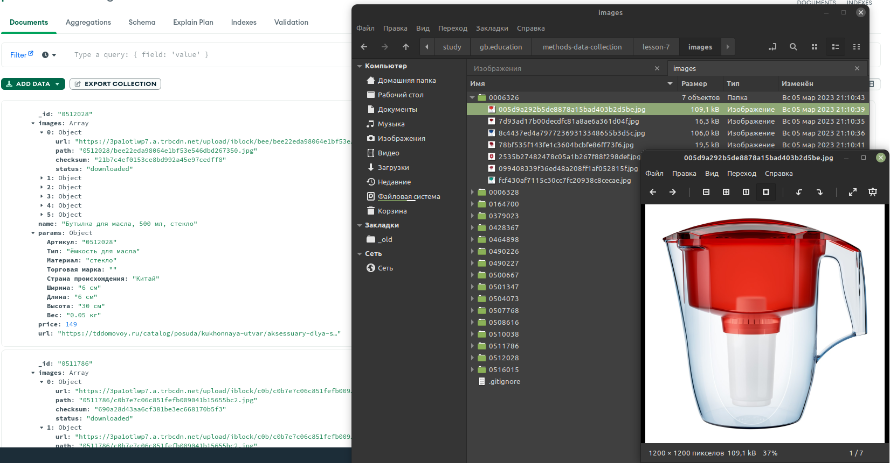

## Урок 7. Парсинг данных. Selenium в Python
### На самом деле задание из урока по scrapy

### Когда делал проект возникли проблемы с доступом к леруа (блокировал из за использования vpn, хотя vpn не использовался), взял  похожий сайт https://tddomovoy.ru/, суть та же

1) Взять любую категорию товаров на сайте Леруа Мерлен. Собрать следующие данные:
- название;
- все фото;
- ссылка;
- цена.

Реализуйте очистку и преобразование данных с помощью ItemLoader. Цены должны быть в виде числового значения.

Дополнительно: 
2) Написать универсальный обработчик характеристик товаров, который будет формировать данные вне зависимости от их типа и количества. 
3) Реализовать хранение скачиваемых файлов в отдельных папках, каждая из которых должна соответствовать собираемому товару 

### Структура
- main.py - мэин скрипт
- scrapy.cfg
- leruacrawler - дирректория с проектом scrapy
- images - дирректория с скачаными изображениями

### Запуск
`python main.py` - Запуск парсинга с сайта 
Или можно воспользоваться методами scrapy 
`scrapy crawl domovoy`

### Результат выполнения

